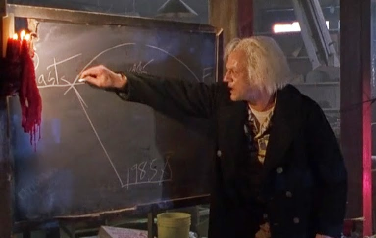

<div align="center">

# great-scott

`great-scott` is a tool that can automatically reverse migrations in a Django project, when switching between different GIT branches.

[Installation](#installation) •
[Usage](#usage) •
[Removing GIT hooks](#removing-git-hooks)



</div>


## Installation

`great-scott` can be installed in 2 easy steps:

1. **Install the tool**

   I recommend installing via [pipx](https://github.com/pypa/pipx):
   ```sh
   pipx install great-scott
   ```

   Alternatively, having the project's virtual-env activated, you can of course install the tool directly into virtual-env:
   ```sh
   python -m pip install great-scott
   ```

2. **Setup GIT hooks**

   After successful installation, while in the GIT-managed project folder and with virtual-env activated, execute:
   ```sh
   great-scott install
   ```


## Usage

Reversing migrations should simply work when the GIT branch is changed:

```sh
$ git checkout main
Switched to branch 'main'
👀 Looking for migrations to reverse on mig-test...
⚠️ reversing migrations for importer (up to 0015)
⚠️ reversing migrations for permissions (up to 0018)
⚠️ reversing migrations for subscriptions (up to 0044)
I have reversed migrations for 3 apps!
```

👉 If you use GIT integration in any of the popular IDEs, such as PyCharm or VSCode, don't forget to properly configure the appropriate python environment there so that automatic reversing of migrations is possible.


## Removing GIT hooks

To remove the GIT hooks, execute the command (while in the project directory and with virtual-env activated):
```sh
great-scott uninstall
```
